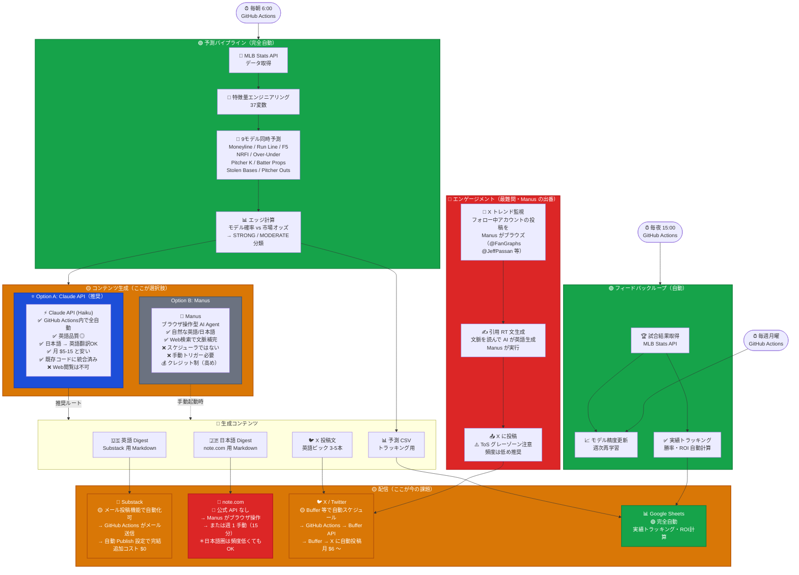

# Moneyball Dojo — システム全体像

> 凡例: 🟢 自動化済み　🟡 要実装/選択中　🔴 手動/未解決

---



---

## 結論：何を使うべきか

| 役割 | ツール | 理由 |
|------|--------|------|
| **コンテンツ生成** | **Claude API** | 安い・全自動・既存コードに統合済み |
| **Substack 配信** | **メール投稿機能** | APIなしで自動化可・追加コスト $0 |
| **X 毎日投稿** | **Buffer ($6/月)** | 最も安全・確実 |
| **note.com 投稿** | **Manus** | APIなし → ブラウザ操作が唯一の自動化手段 |
| **X エンゲージメント** | **Manus（週数回）** | Web閲覧 + 文脈理解が必要 → Manus の得意領域 |
| **実績トラッキング** | **GitHub Actions** | 既に自動 |

## Manus をどう使うか（具体的）

Manus はスケジューラではなく **「お願いすると動いてくれる賢いエージェント」**。

```
毎週月曜（30分）:
  Manus に「今週の note.com 記事を投稿して」と指示
  → Manus が note.com にログイン → 記事コピペ → 投稿

週 2-3 回:
  Manus に「@FanGraphs や @JeffPassan の最新ツイートを見て、
  MoneyballDojo として引用RTして」と指示
  → Manus が X をブラウズ → 文脈に合う引用RT を投稿
```

**Taiki の実質作業時間: 週 30-60 分**（完全ゼロは現実的に困難）
